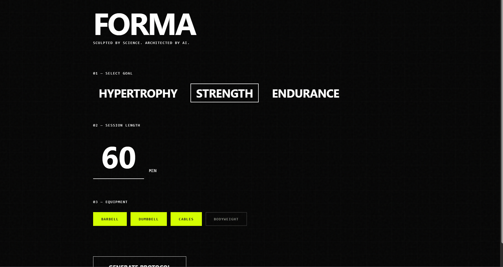
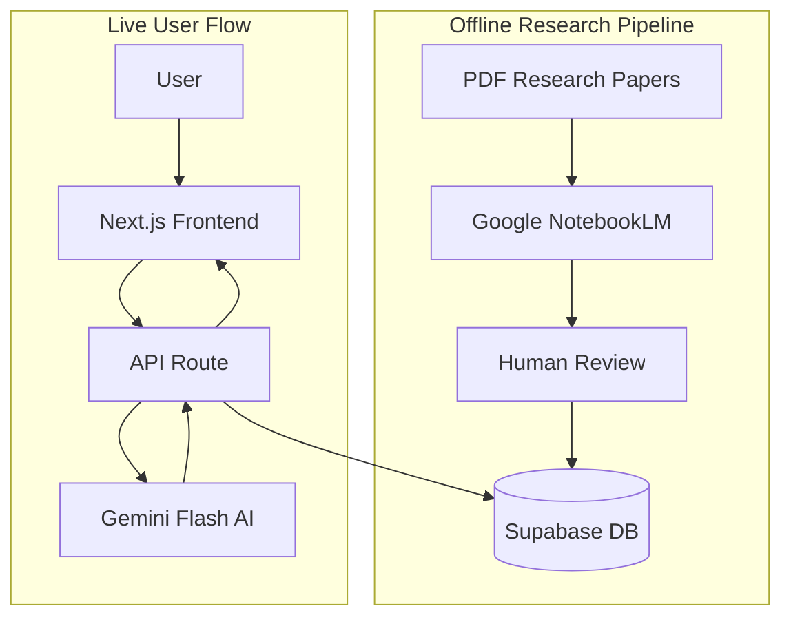

# FORMA

> Sculpted by Science. Architected by AI.

<p align="center">
  <strong>Science-backed fitness programs generated in seconds.</strong>
  <br><br>
  <a href="https://forma-two.vercel.app/">🔗 Live Demo</a>
</p>

<p align="center">
  
</p>

---

## ✨ What is FORMA?

FORMA uses **Gemini AI** to create personalized workout plans based on your goals, available time, and equipment. Each exercise includes science notes explaining _why_ it's in your program.

## 🏗 System Architecture



## 🔧 Key Technical Decisions

### Decision 1: The Hybrid RAG Approach

| Aspect       | Details                                                                                                                                                                                          |
| ------------ | ------------------------------------------------------------------------------------------------------------------------------------------------------------------------------------------------ |
| **Context**  | Pure LLMs hallucinate exercises (inventing fake movements) and using them for full content generation is token-expensive.                                                                        |
| **Solution** | Implemented a "Logic-Only" AI pattern. The AI only selects Exercise IDs (Integers) based on logic. The textual content (Name, Instructions, Science) is fetched from a static Supabase database. |
| **Outcome**  | Eliminated hallucinations 100% and reduced API token usage by ~90% per request.                                                                                                                  |

### Decision 2: The "Readable ID" Pattern

| Aspect       | Details                                                                                                             |
| ------------ | ------------------------------------------------------------------------------------------------------------------- |
| **Context**  | UUIDs (e.g., `a0eebc99-9c0b...`) consume excessive tokens when fed to an LLM context window.                        |
| **Solution** | Implemented a secondary `readable_id` (Integer) column for AI processing, mapping back to UUIDs on the client side. |
| **Outcome**  | Improved Gemini latency and reduced cost overhead.                                                                  |

## ⚠️ Constraints & Future Roadmap

| Constraint                                                                                    | Mitigation / Roadmap                                                                                    |
| --------------------------------------------------------------------------------------------- | ------------------------------------------------------------------------------------------------------- |
| **Cold Start Latency** — Vercel Free Tier serverless functions may experience 2-3s cold start | Implemented a client-side "Tactical Loading Sequence" to mask latency and improve perceived performance |
| **Database Static Nature** — Exercise list is manually curated                                | **Roadmap:** Build an admin dashboard for automated ingestion of new NotebookLM insights                |

## 🛠 Tech Stack

| Layer      | Technology               |
| ---------- | ------------------------ |
| Framework  | Next.js 14+ (App Router) |
| Styling    | Tailwind CSS             |
| Database   | Supabase                 |
| AI         | Google Gemini            |
| Animations | Anime.js                 |

## 🚀 Quick Start

```bash
# Install dependencies
npm install

# Set up environment variables
cp .env.example .env.local
```

### Database Setup

1. Go to your [Supabase SQL Editor](https://supabase.com/dashboard)
2. Run the SQL script found in `src/sql/schema.sql`

```bash
# Run development server
npm run dev
```

Open [http://localhost:3000](http://localhost:3000)

## 🔑 Environment Variables

```env
NEXT_PUBLIC_SUPABASE_URL=your_supabase_url
NEXT_PUBLIC_SUPABASE_ANON_KEY=your_anon_key
GEMINI_API_KEY=your_gemini_api_key
```

## 📁 Project Structure

```
src/
├── app/
│   ├── api/generate-plan/   # AI workout generation endpoint
│   └── page.tsx             # Main interface
├── components/
│   └── WorkoutCard.tsx      # Exercise display with tooltips
└── lib/
    ├── supabase.ts          # Database client
    └── gemini.ts            # AI client + prompt engineering
```

## ⚡ Features

- **Goal Selection** — Hypertrophy, Strength, or Endurance
- **Smart Programming** — AI selects exercises from your database
- **Science Notes** — Hover to see why each exercise is included
- **PDF Export** — Download your blueprint for offline use

---

## 📜 License

Copyright © 2025 Forma. All rights reserved.

---

<p align="center">
  <sub>Built with 🧠 and 💪</sub>
</p>
