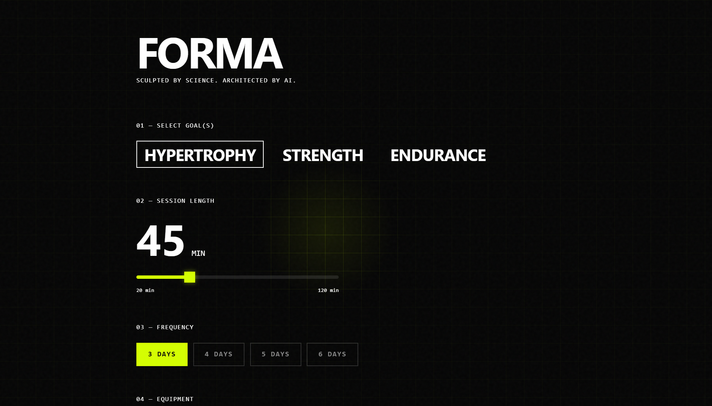

# FORMA

> Sculpted by Science. Architected by AI.

<p align="center">
  
  
  
  
</p>

<p align="center">
  <strong>Science-backed fitness programs generated in seconds.</strong>
  <br><br>
  <a href="https://forma-two.vercel.app/">🔗 Live Demo</a> · 
  <a href="VERSION-1.3.md">📋 v1.3 Release Notes</a> · 
  <a href="ROADMAP.md">🗺️ Roadmap</a> ·
  <a href="SECURITY.md">🔒 Security</a> ·
  <a href="CONTRIBUTING.md">🤝 Contributing</a>
</p>

<p align="center">
  
</p>

---

## ✨ What is FORMA?

FORMA uses **Gemini AI** to create personalized workout plans based on your goals, available time, and equipment. Each exercise includes science notes explaining _why_ it's in your program.

## 🏗 System Architecture

```mermaid
graph TD
    subgraph Offline["Offline Research Pipeline"]
        A[PDF Research Papers] --> B[Google NotebookLM]
        B --> C[Human Review]
        C --> D[(Supabase DB)]
    end

    subgraph Admin["Admin Pipeline (v1.3)"]
        Admin[Admin User] --> PIN{PIN Auth}
        PIN --> Dashboard[Admin Dashboard]
        Dashboard --> Upload[PDF/CSV/TXT Upload]
        Upload --> Ingest[Neural Ingestor API]
        Ingest --> Gemini2[Gemini AI - Extract]
        Gemini2 --> Dedupe[Smart Deduplication]
        Dedupe -->|Service Role Key| D
    end

    subgraph Live["Live User Flow"]
        User[User] --> UI[Next.js Frontend]
        UI --> API[Generate Plan API]
        API -->|Anon Key| D
        API --> Rotate{Key Rotation}
        Rotate --> Key1[Gemini Key 1]
        Rotate --> Key2[Gemini Key 2]
        Rotate --> Key3[Gemini Key 3]
        Key1 & Key2 & Key3 --> AI[Gemini Flash Lite]
        AI --> API
        API --> UI
    end
```

## 🔧 Key Technical Decisions

### Decision 1: The Hybrid RAG Approach

| Aspect       | Details                                                                                                                                                                                          |
| ------------ | ------------------------------------------------------------------------------------------------------------------------------------------------------------------------------------------------ |
| **Context**  | Pure LLMs hallucinate exercises (inventing fake movements) and using them for full content generation is token-expensive.                                                                        |
| **Solution** | Implemented a "Logic-Only" AI pattern. The AI only selects Exercise IDs (Integers) based on logic. The textual content (Name, Instructions, Science) is fetched from a static Supabase database. |
| **Outcome**  | Eliminated hallucinations 100% and reduced API token usage by ~90% per request.                                                                                                                  |

### Decision 2: The "Readable ID" Pattern

| Aspect       | Details                                                                                                             |
| ------------ | ------------------------------------------------------------------------------------------------------------------- |
| **Context**  | UUIDs (e.g., `a0eebc99-9c0b...`) consume excessive tokens when fed to an LLM context window.                        |
| **Solution** | Implemented a secondary `readable_id` (Integer) column for AI processing, mapping back to UUIDs on the client side. |
| **Outcome**  | Improved Gemini latency and reduced cost overhead.                                                                  |

## ⚠️ Constraints & Future Roadmap

| Constraint                                                                                    | Mitigation / Roadmap                                                                                    |
| --------------------------------------------------------------------------------------------- | ------------------------------------------------------------------------------------------------------- |
| **Cold Start Latency** — Vercel Free Tier serverless functions may experience 2-3s cold start | Implemented a client-side "Tactical Loading Sequence" to mask latency and improve perceived performance |
| **Database Static Nature** — Exercise list is manually curated                                | ✅ **Solved:** Admin Dashboard with Neural Ingestor for AI-powered bulk uploads                         |

## 🛠 Tech Stack

| Layer      | Technology                                                                                                                                                                  |
| ---------- | --------------------------------------------------------------------------------------------------------------------------------------------------------------------------- |
| Framework  | Next.js 14+ (App Router)                                                                                                                                                    |
| Styling    | Tailwind CSS v4                                                                                                                                                             |
| Database   | Supabase                                                                                                                                                                    |
| AI         | **Gemini 2.5 Flash Lite** — Response latency reduced from ~25s to ~10s. Flash Lite provides superior throughput for JSON tasks vs standard Flash models hitting 429 limits. |
| Animations | Anime.js                                                                                                                                                                    |

## 🎨 Design System: Refined Brutalism

FORMA employs a **Refined Brutalism** aesthetic—raw, industrial foundations softened with intentional micro-details:

| Element         | Style                            | Rationale                                                                                |
| --------------- | -------------------------------- | ---------------------------------------------------------------------------------------- |
| Cards & Buttons | `rounded-sm` (2px)               | Micro-radii based on user feedback (Mahesh). Softens edges without losing brutalist DNA. |
| Typography      | High contrast, monospace accents | Technical, blueprint feel.                                                               |
| Animations      | Smooth easing, subtle pulses     | Adds life without compromising the industrial vibe.                                      |
| Colors          | Acid green accent on dark base   | High-energy, gym-culture aesthetic.                                                      |

## 🚀 Quick Start

```bash
# Install dependencies
npm install

# Set up environment variables
cp .env.example .env.local
```

### Database Setup

1. Go to your [Supabase SQL Editor](https://supabase.com/dashboard)
2. Run the SQL script found in `src/sql/schema.sql`

```bash
# Run development server
npm run dev
```

Open [http://localhost:3000](http://localhost:3000)

## 🔑 Environment Variables

```env
NEXT_PUBLIC_SUPABASE_URL=your_supabase_url
NEXT_PUBLIC_SUPABASE_ANON_KEY=your_anon_key
GEMINI_API_KEY_1=your_primary_gemini_key
GEMINI_API_KEY_2=your_backup_gemini_key     # Optional
GEMINI_API_KEY_3=your_tertiary_gemini_key   # Optional
```

## 📁 Project Structure

```
src/
├── app/
│   ├── api/
│   │   ├── generate-plan/   # AI workout generation endpoint
│   │   └── admin/ingest/    # Neural Ingestor API (PDF → DB)
│   ├── admin/page.tsx       # Admin Dashboard (PIN-protected)
│   └── page.tsx             # Main interface
├── components/
│   ├── WorkoutCard.tsx      # Exercise display with tooltips
│   └── IntelLoader.tsx      # Goal-based loading tips
└── lib/
    ├── supabase.ts          # Database client
    └── gemini.ts            # AI prompt engineering
```

## ⚡ Features

- **Multi-Goal Selection** — Hypertrophy, Strength, Endurance, or Hybrid combinations
- **Adaptive Duration Picker** — iOS-style drum wheel (mobile) + slider (desktop)
- **Frequency Control** — Choose 3, 4, 5, or 6 training days per week
- **Equipment Filtering** — Plans adapt to your available gear
- **Interactive Background** — Cursor-tracking spotlight grid effect
- **Smart Programming** — AI selects exercises from curated database
- **Science Notes** — Tap to see why each exercise is included
- **PDF Export** — High-contrast blueprint for offline use
- **🛡️ Smart Rate Limiting** — 3-key API rotation for 99.9% uptime
- **🧠 Intel Loader** — Goal-specific science tips during generation
- **🧬 Neural Ingestor** — AI-powered PDF parsing for bulk exercise uploads (Admin)

## 📈 What's New in v1.3.0 (The Brain)

- 🧬 **Neural Ingestor** — AI-powered admin tool parses PDFs to auto-populate exercise database
- 🔐 **Admin Dashboard** — PIN-protected `/admin` route for database management
- 🧠 **Smart Deduplication** — Prevents duplicate exercises with case-insensitive name matching
- ⚡ **Batch Processing** — Handles 100k+ characters, inserts exercises in <10 seconds
- 📄 **Multi-Format Support** — Accepts PDF, CSV, and TXT uploads

---

## 📜 License

Copyright © 2025 Forma. All rights reserved.

---

<p align="center">
  <sub>Built with 🧠 and 💪</sub>
</p>
